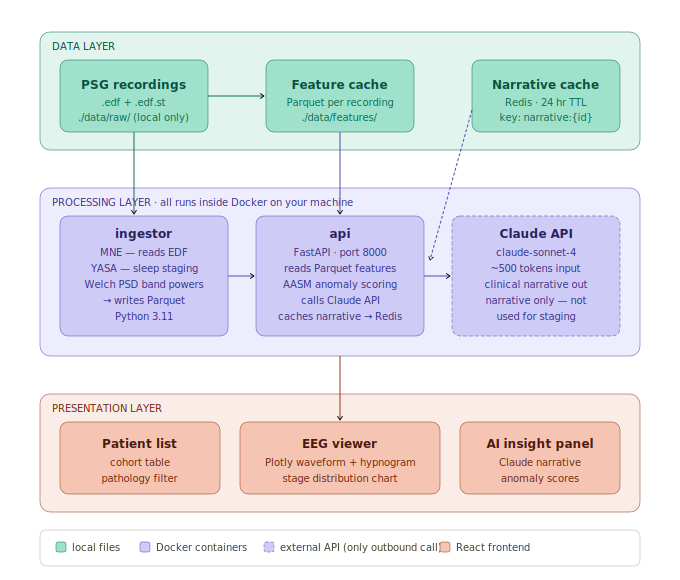

# Sleep Disorder AI Dashboard

Portfolio proof-of-concept for automated sleep study analysis using EEG/PSG data.
Ingests PhysioNet EDF recordings, runs YASA sleep staging, detects anomalies against
AASM adult norms, and generates AI clinical narrative summaries via the Anthropic Claude API.

## Architecture



Four-service Docker Compose stack, all communication internal to the Docker network:


| Service    | Description                                              |
|------------|----------------------------------------------------------|
| ingestor   | Reads EDF files, runs YASA sleep staging, writes Parquet |
| api        | FastAPI — serves features, triggers Claude narratives    |
| frontend   | React + Vite + Plotly dashboard                          |
| redis      | Narrative cache keyed by filename                        |

## Prerequisites

- **Docker Desktop** 4.x or later (with Compose v2)
- **Anthropic API key** — obtain at [console.anthropic.com](https://console.anthropic.com/settings/keys)
- EDF files from the [PhysioNet CAP Sleep Database](https://physionet.org/content/capslpdb/)
  (download separately; files are never committed to this repository)

## Setup

```bash
# 1. Clone the repository
git clone <repo-url>
cd sleep-dashboard

# 2. Create your environment file from the example
cp .env.example .env
# Edit .env and replace sk-ant-your-key-here with your real Anthropic API key

# 3. Place EDF files in the data directory
#    Example: data/raw/ins1.edf  (CAP Sleep Database filenames — see "Adding EDF files" below)
```

## How to Run

```bash
docker compose up --build
```

- Dashboard: http://localhost:5173
- API docs: http://localhost:8000/docs

The ingestor runs automatically on startup and stages all EDF files found in `data/raw/`.
Subsequent `docker compose up` calls skip already-processed files (Parquet cache present).

Alternatively, use the Makefile shortcuts:

```bash
make build   # docker compose build
make up      # docker compose up -d
make down    # docker compose down
make logs    # docker compose logs -f
```

## Adding EDF Files

1. Copy `.edf` files into `./data/raw/`.
   Files must follow CAP Sleep Database naming conventions for pathology inference:

   | Prefix | Pathology                       |
   |--------|---------------------------------|
   | `ins`  | Insomnia                        |
   | `nfle` | Nocturnal Frontal Lobe Epilepsy |
   | `rbd`  | REM Behavior Disorder           |
   | `sdb`  | Sleep-Disordered Breathing      |
   | `plm`  | Periodic Leg Movements          |
   | `brux` | Bruxism                         |
   | `nar`  | Narcolepsy                      |
   | `n`    | Normal                          |

2. Restart the ingestor: `docker compose restart ingestor`
   — or use the **Upload EDF** button in the dashboard to process a single file on demand.

## Data Privacy

EDF sleep study files contain sensitive biometric data. This project is designed so that:

- EDF files are **never committed to git** (excluded by `.gitignore`)
- EDF files are **never sent to any remote server** — all signal processing (YASA staging,
  band power extraction) runs entirely on your local machine inside Docker containers
- Only de-identified aggregate statistics (stage percentages, latencies, transition counts)
  are sent to the Anthropic Claude API to generate the clinical narrative
- The Anthropic API key is stored in `.env` (gitignored) and optionally in browser
  `localStorage` for the in-browser key-entry flow; it is never logged or persisted elsewhere

## License

MIT License — see [LICENSE](LICENSE) for full text.

> This software is provided for portfolio and educational purposes only.
> It is not a medical device and must not be used for clinical diagnosis or treatment decisions.

## See Also

- [DECISIONS.md](DECISIONS.md) — recorded architecture decisions

